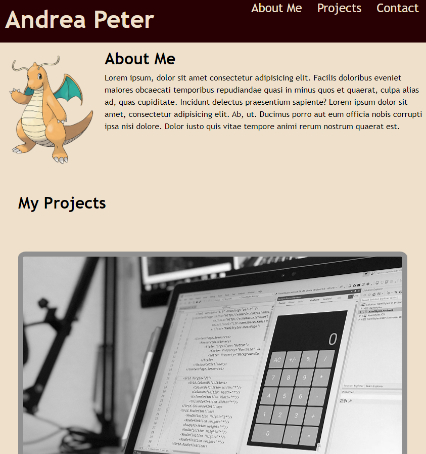
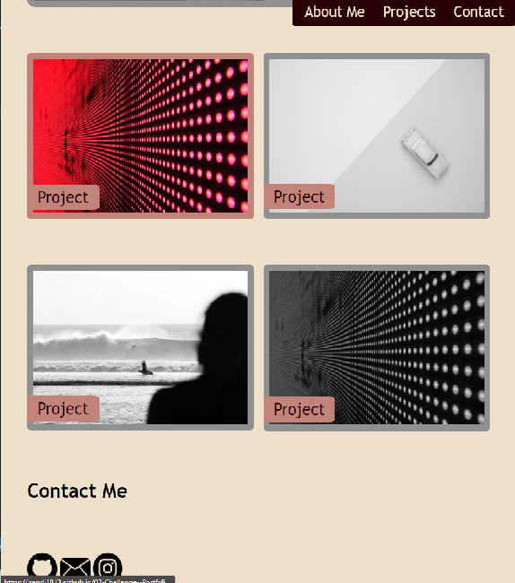

## Table of contents

- [Overview](#overview)
  - [The challenge](#the-challenge)
  - [Screenshot](#screenshot)
  - [Links](#links)
- [My process](#my-process)
  - [Built with](#built-with)
  - [What I learned](#what-i-learned)
  - [Continued development](#continued-development)
  - [Useful resources](#useful-resources)
- [Author](#author)
- [Acknowledgments](#acknowledgments)

**Note: Delete this note and update the table of contents based on what sections you keep.**

## Overview

### The challenge

Creating a portfolio webpage using semantic HTML elements and to style it using CSS.
Page has to be responsive and adapt to various screen sizes
  

### Screenshot





### Links

- [Live Site URL](https://pandi1813.github.io/02-Challenge--Portfolio/)

## My process

### Built with

- Semantic HTML5 markup
- CSS custom properties
- Flexbox
- CSS Grid
- Mobile-first design


### What I learned

Using variables instead of colour code in CSS

```css
:root {
  --dark-color: #280003;
  --light-color: #EEE0CB;
  --mid-color-1: #C2847A;
  --mid-color-2: #848586;
}
```

```css
header h1 {
  background-color: var(--dark-color);
  width: 100%;
  color: var(--light-color);
}
```

  
  
```css
.project-examples {
  display: grid;
  grid-template-columns: 1fr 1fr;
  gap: 2%;
  grid-template-areas: 
  "project-2 project-2"
  "project-1 project-3"
  "project-4 project-5";
}
```

If you want more help with writing markdown, we'd recommend checking out [The Markdown Guide](https://www.markdownguide.org/) to learn more.

**Note: Delete this note and the content within this section and replace with your own learnings.**

### Continued development

Use this section to outline areas that you want to continue focusing on in future projects. These could be concepts you're still not completely comfortable with or techniques you found useful that you want to refine and perfect.

**Note: Delete this note and the content within this section and replace with your own plans for continued development.**

### Useful resources

- [Example resource 1](https://www.example.com) - This helped me for XYZ reason. I really liked this pattern and will use it going forward.
- [Example resource 2](https://www.example.com) - This is an amazing article which helped me finally understand XYZ. I'd recommend it to anyone still learning this concept.

**Note: Delete this note and replace the list above with resources that helped you during the challenge. These could come in handy for anyone viewing your solution or for yourself when you look back on this project in the future.**

## Author
  Your Name
- Website - [your name or website url](https://www.your-site.com)
- GitHub - [your GitHub username](https://github.com/yourusername)

**Note: Delete this note and add/remove/edit lines above based on what links you'd like to share.**

## Acknowledgments

This is where you can give a hat tip to anyone who helped you out on this project. Perhaps you worked in a team or got some inspiration from someone else's solution. This is the perfect place to give them some credit.

**Note: Delete this note and edit this section's content as necessary. If you completed this challenge by yourself, feel free to delete this section entirely.**